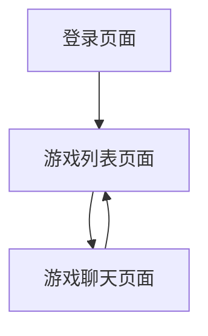

## 1. Product Overview
海龟汤猜谜游戏是一个基于Web的文字推理游戏平台，用户通过与AI主持人对话来猜测谜题答案。
- 解决用户娱乐需求，提供智力挑战和推理乐趣，适合喜欢逻辑推理的用户群体。
- 目标是打造一个简单易用、可扩展的在线推理游戏平台。

## 2. Core Features

### 2.1 User Roles
由于产品采用统一密码登录且不存储用户记录，无需区分用户角色。所有用户登录后享有相同权限。

### 2.2 Feature Module
我们的海龟汤猜谜游戏包含以下主要页面：
1. **登录页面**：密码验证，进入游戏。
2. **游戏列表页面**：展示所有可玩游戏，选择游戏。
3. **游戏聊天页面**：与AI主持人对话，进行推理猜谜。

### 2.3 Page Details

| Page Name | Module Name | Feature description |
|-----------|-------------|---------------------|
| 登录页面 | 密码验证 | 输入统一密码验证身份，验证成功后跳转到游戏列表 |
| 游戏列表页面 | 游戏展示 | 展示所有可用游戏的标题和简介，支持点击选择 |
| 游戏列表页面 | 游戏选择 | 点击游戏卡片进入对应的游戏聊天界面 |
| 游戏聊天页面 | 聊天界面 | 类似chatbox的对话界面，显示用户问题和AI回答 |
| 游戏聊天页面 | AI交互 | 集成OpenAI SDK，发送用户问题和游戏上下文给AI模型 |
| 游戏聊天页面 | 返回功能 | 提供返回游戏列表的按钮，可重新选择游戏 |

## 3. Core Process
用户首先在登录页面输入统一密码进行身份验证。验证成功后进入游戏列表页面，浏览所有可用的海龟汤游戏并选择感兴趣的游戏。选择游戏后进入聊天界面，用户可以向AI主持人提出各种问题来推理谜题答案，AI会根据游戏规则和谜底给出相应回答。用户可以随时返回游戏列表选择其他游戏。

## 4. User Interface Design
### 4.1 Design Style
- 主色调：深蓝色(#1a365d)和橙色(#ed8936)，营造神秘推理氛围
- 按钮样式：圆角按钮，悬停时有阴影效果
- 字体：系统默认字体，标题16-20px，正文14-16px
- 布局风格：卡片式布局，顶部导航栏
- 图标风格：简洁的线性图标，支持emoji表情

### 4.2 Page Design Overview

| Page Name | Module Name | UI Elements |
|-----------|-------------|-------------|
| 登录页面 | 密码验证 | 居中卡片布局，包含密码输入框、登录按钮，深色背景配橙色按钮 |
| 游戏列表页面 | 游戏展示 | 网格布局的游戏卡片，每个卡片显示游戏标题、简介和缩略图 |
| 游戏聊天页面 | 聊天界面 | 类似微信的聊天气泡布局，用户消息右对齐，AI消息左对齐 |
| 游戏聊天页面 | 返回功能 | 顶部导航栏包含返回按钮和游戏标题 |

### 4.3 Responsiveness
产品采用移动优先的响应式设计，支持手机端浏览器访问，包含触摸交互优化和适配不同屏幕尺寸。